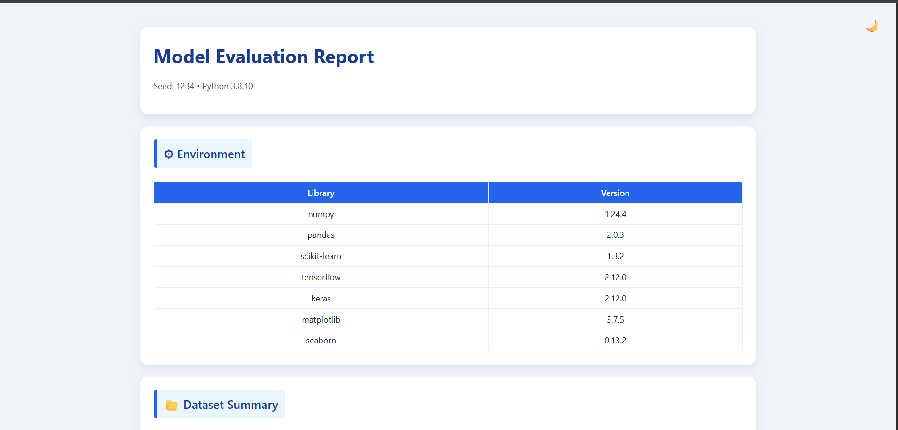

# RobustifyAI - ML Model Evaluation Platform

A comprehensive machine learning model evaluation platform that provides detailed analysis of model performance, robustness, calibration, and explainability through both a web interface and standalone evaluation tools.

## 🚀 Features

### Core Evaluation Capabilities
- **Performance Metrics**: Accuracy, Precision, Recall, F1-Score with confidence intervals
- **Robustness Testing**: Gaussian noise, blur, JPEG compression, occlusion attacks
- **Calibration Analysis**: Brier score, Expected Calibration Error (ECE), reliability diagrams
- **Explainability**: LIME attribution maps with stability analysis
- **Statistical Testing**: Permutation tests, effect size calculations, bootstrap confidence intervals
- **Efficiency Metrics**: Model size, parameter count, inference latency, memory usage

### Web Interface
- **Modern Dashboard**: Real-time evaluation progress tracking
- **Interactive Visualizations**: Charts, metrics cards, robustness analysis
- **File Upload**: Support for both ZIP archives and folder uploads
- **Report Generation**: Beautiful HTML reports with dark/light mode
- **API Integration**: RESTful API for programmatic access

### Report Features
- **Comprehensive HTML Reports**: Professional styling with interactive elements
- **JSON Export**: Machine-readable evaluation results
- **Visual Analytics**: Confusion matrices, calibration curves, robustness charts
- **LIME Visualizations**: Attribution maps showing model decision regions
- **Statistical Summaries**: Confidence intervals, significance tests

## 📁 Project Structure

```
RobustifyAI_website/
├── RobustifyAI/                 # Core evaluation engine
│   ├── eval_core.py            # Main evaluation pipeline
│   ├── run_evaluation.py       # CLI interface
│   ├── models/                 # Pre-trained models
│   ├── dataset/                # Sample datasets
│   ├── templates/              # HTML report templates
│   ├── reports/                # Generated evaluation reports
│   └── venv/                   # Python virtual environment
├── holo-viz/                   # React web interface
│   ├── src/
│   │   ├── components/         # React components
│   │   ├── lib/               # API utilities
│   │   └── hooks/             # Custom React hooks
│   ├── public/                # Static assets
│   └── package.json           # Node.js dependencies
├── server/                     # FastAPI backend
│   └── main.py                # API server
└── README.md                  # This file
```

## 🛠️ Installation

### Prerequisites
- Python 3.8+
- Node.js 16+
- Git

### 1. Clone the Repository
```bash
git clone https://github.com/BhaviN-1-7/RobustifyAI.git
cd RobustifyAI
```

### 2. Set Up Python Environment
```bash
cd RobustifyAI
python -m venv venv

# Windows
venv\Scripts\activate

# Linux/Mac
source venv/bin/activate

pip install -r requirements.txt
```

### 3. Set Up Web Interface
```bash
cd ../holo-viz
npm install
```

## 📸 Interface Screenshots

### Model Upload Interface

*Model upload and configuration interface*


*Model details and parameter settings*

### Terminal Interface

*Command-line evaluation interface and logs*

### Dashboard Interface

*Main dashboard showing evaluation progress and results*


*Detailed metrics and confusion matrix visualization*


*Robustness testing and performance analysis*


*Model efficiency and explainability results*

### Sample Report

*Generated HTML evaluation report*

**🔗 [View Live Sample Report](RobustifyAI/reports/report.html)**

## 🚀 Usage

### Method 1: Web Interface (Recommended)

1. **Start the FastAPI Backend Server**:
```bash
# Windows
cd "C:\Users\pacha\OneDrive\Documents\PROJECTS\RobustifyAI_website"
set PYTHON_BIN=RobustifyAI\venv\Scripts\python.exe
set RUN_SCRIPT=RobustifyAI\run_evaluation.py
set REPORTS_DIR=RobustifyAI\reports
uvicorn server.main:app --host 127.0.0.1 --port 8080 --reload

# Linux/Mac
cd /path/to/RobustifyAI_website
export PYTHON_BIN=RobustifyAI/venv/bin/python
export RUN_SCRIPT=RobustifyAI/run_evaluation.py
export REPORTS_DIR=RobustifyAI/reports
uvicorn server.main:app --host 127.0.0.1 --port 8080 --reload
```

2. **Start the React Frontend**:
```bash
cd holo-viz
npm run dev
```

3. **Access the Dashboard**:
   - Backend API: http://localhost:8080
   - Frontend Dashboard: http://localhost:5173
   - Upload your model (.h5 file) and dataset (ZIP or folder)
   - Monitor evaluation progress in real-time
   - View comprehensive results in the dashboard

### Method 2: Command Line Interface

```bash
cd RobustifyAI
python run_evaluation.py --dataset ./dataset --model models/catsdogs_model.h5 --out reports/my_evaluation --seed 1234
```

**Parameters**:
- `--dataset`: Path to dataset folder (with train/test subfolders or class subfolders)
- `--model`: Path to Keras model (.h5 file)
- `--out`: Output directory for reports
- `--seed`: Random seed for reproducibility
- `--test_ratio`: Test split ratio if no train/test folders (default: 0.2)

## 📊 Dataset Format

### Option 1: Pre-split Dataset
```
dataset/
├── train/
│   ├── class1/
│   │   ├── image1.jpg
│   │   └── image2.jpg
│   └── class2/
│       ├── image1.jpg
│       └── image2.jpg
└── test/
    ├── class1/
    └── class2/
```

### Option 2: Single Dataset (Auto-split)
```
dataset/
├── class1/
│   ├── image1.jpg
│   └── image2.jpg
└── class2/
    ├── image1.jpg
    └── image2.jpg
```

## 📈 Evaluation Pipeline

The evaluation process includes:

1. **Environment Setup**: Capture system information and dependencies
2. **Data Loading**: Process images and create train/test splits
3. **Model Analysis**: Load model and extract architecture details
4. **Inference**: Run predictions with timing measurements
5. **Metrics Calculation**: Compute accuracy, precision, recall, F1-score
6. **Statistical Analysis**: Bootstrap confidence intervals, permutation tests
7. **Robustness Testing**: Apply corruptions and measure performance degradation
8. **Calibration Analysis**: Assess prediction confidence reliability
9. **Explainability**: Generate LIME attribution maps
10. **Report Generation**: Create HTML and JSON outputs

## 🔧 FastAPI RESTful API

The backend uses **FastAPI** to provide a modern, high-performance RESTful API with automatic OpenAPI documentation.

### Environment Variables
Set these environment variables before starting the server:
- `PYTHON_BIN`: Path to Python executable in virtual environment
- `RUN_SCRIPT`: Path to evaluation script
- `REPORTS_DIR`: Directory for storing evaluation reports

### Core API Endpoints
- `POST /api/evaluate` - Start evaluation with local paths
- `POST /api/upload_evaluate` - Upload files and evaluate
- `POST /api/upload_evaluate_zip` - Upload ZIP dataset and model
- `POST /api/upload_evaluate_folder` - Upload folder dataset and model
- `GET /api/status/{job_id}` - Check evaluation progress
- `GET /api/report/{job_id}.html` - Download HTML report
- `GET /api/report/{job_id}.json` - Download JSON results
- `GET /api/logs/{job_id}` - View evaluation logs

### API Documentation
- Interactive API docs: http://localhost:8080/docs
- OpenAPI schema: http://localhost:8080/openapi.json

## 📋 Requirements

### Python Dependencies
- tensorflow==2.12.0
- keras==2.12.0
- numpy==1.23.5
- pandas==2.0.3
- scikit-learn==1.3.2
- matplotlib==3.7.5
- seaborn==0.13.2
- lime==0.2.0.1
- scikit-image==0.21.0
- fastapi==0.104.1
- uvicorn==0.24.0
- jinja2==3.1.2
- psutil==5.9.6

### Node.js Dependencies
- React 18
- TypeScript
- Vite
- Tailwind CSS
- Recharts
- Framer Motion
- Lucide React

## 🎯 Example Use Cases

### 1. Model Comparison
Compare multiple models on the same dataset to identify the best performer:
```bash
python run_evaluation.py --dataset ./dataset --model models/model_v1.h5 --out reports/v1
python run_evaluation.py --dataset ./dataset --model models/model_v2.h5 --out reports/v2
```

### 2. Robustness Analysis
Evaluate how your model performs under various corruptions and adversarial conditions.

### 3. Calibration Assessment
Determine if your model's confidence scores are well-calibrated for reliable uncertainty estimation.

### 4. Explainability Study
Generate LIME attribution maps to understand which image regions influence model decisions.

## 🔍 Understanding Results

### Key Metrics
- **Accuracy**: Overall correctness percentage
- **Precision/Recall**: Class-specific performance measures
- **Brier Score**: Calibration quality (lower is better)
- **ECE**: Expected Calibration Error (lower is better)
- **Robustness Scores**: Performance under corruptions
- **Stability Score**: Consistency of explanations

### Report Sections
1. **Environment**: System and library versions
2. **Dataset Summary**: Class distributions and splits
3. **Performance Metrics**: Detailed accuracy analysis
4. **Statistical Analysis**: Confidence intervals and significance tests
5. **Calibration**: Reliability diagrams and calibration metrics
6. **Robustness**: Corruption resistance analysis
7. **Explainability**: LIME attribution visualizations
8. **Efficiency**: Resource usage and timing

## 🤝 Contributing

1. Fork the repository
2. Create a feature branch (`git checkout -b feature/amazing-feature`)
3. Commit your changes (`git commit -m 'Add amazing feature'`)
4. Push to the branch (`git push origin feature/amazing-feature`)
5. Open a Pull Request

## 📝 License

This project is licensed under the MIT License - see the LICENSE file for details.

## 🙏 Acknowledgments

- LIME library for explainable AI capabilities
- TensorFlow/Keras for deep learning framework
- React and modern web technologies for the interface
- FastAPI for the robust backend API

## 📞 Support

For questions, issues, or contributions:
- Open an issue on GitHub
- Check the documentation in the `docs/` folder
- Review example notebooks in `examples/`

---

**RobustifyAI** - Making ML model evaluation comprehensive, accessible, and actionable.
